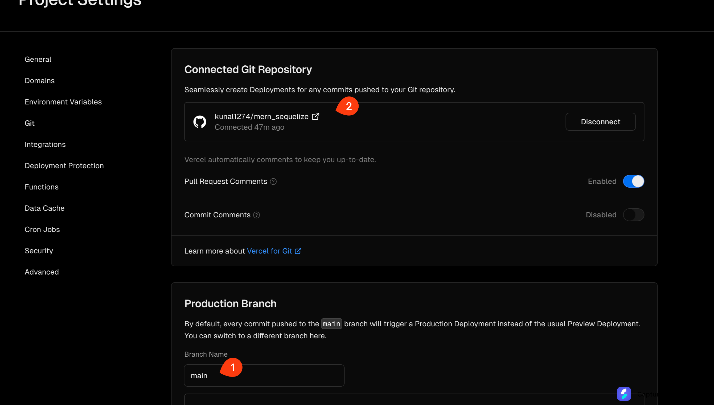
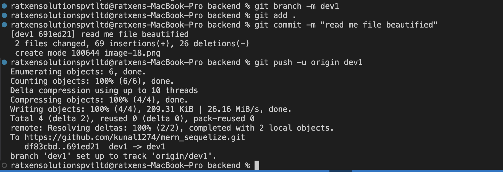
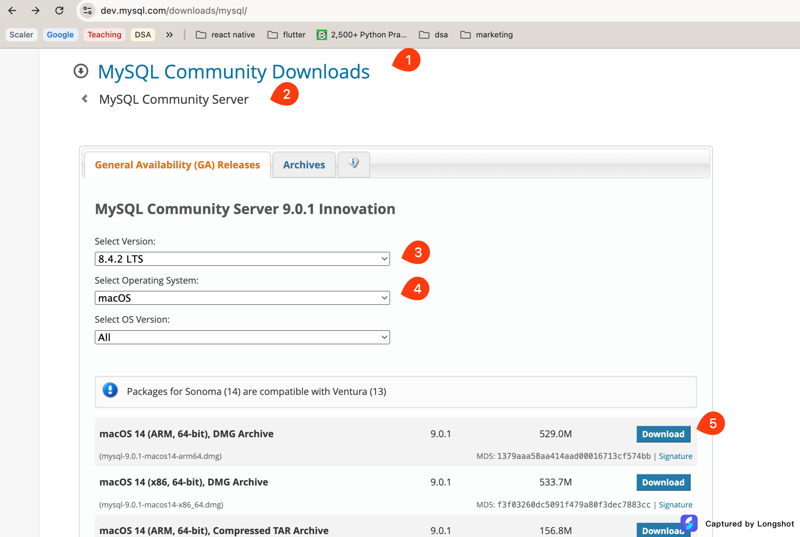
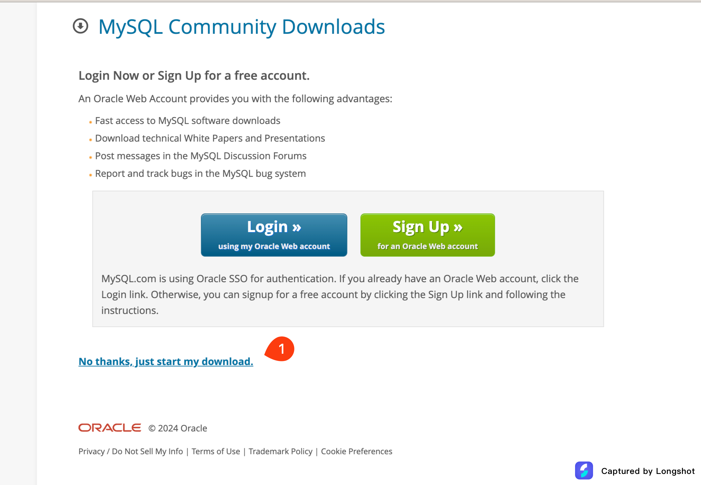
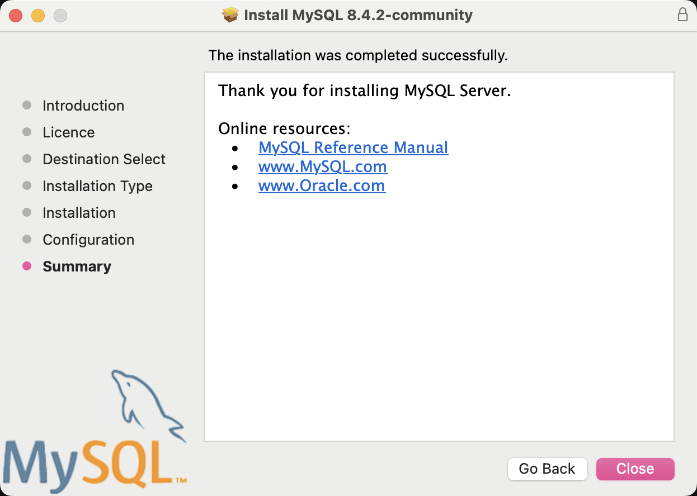
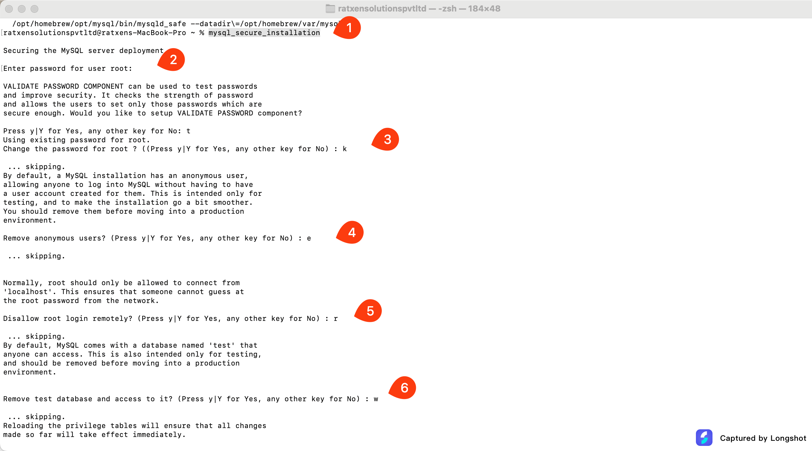
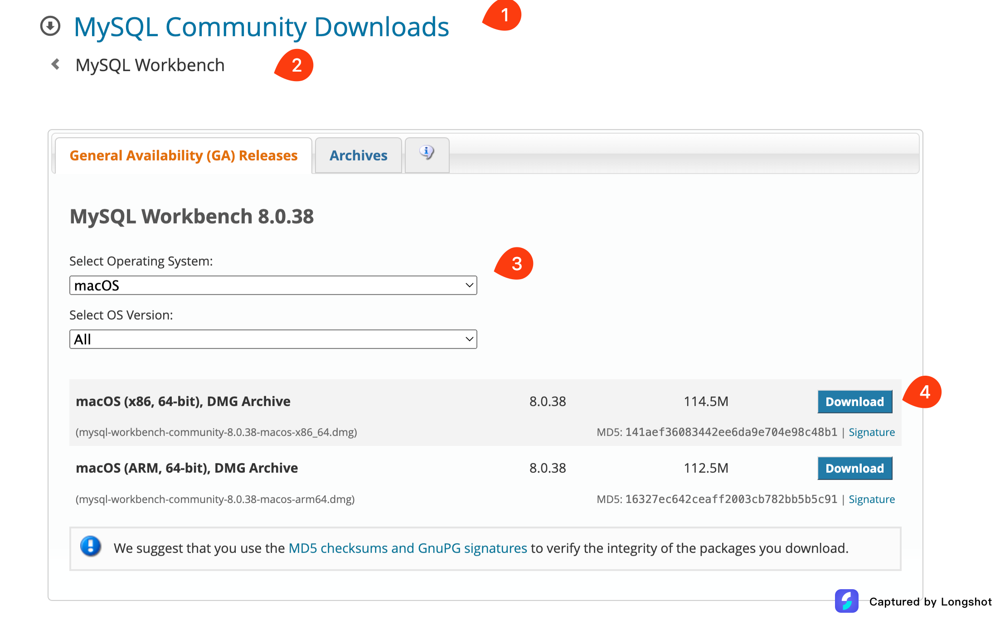

Here we will copy all the steps of the screen shot .

##### starting the node project

```sh
npm init
```


##### updating the npm :

```sh
npm install -g npm@10.8.2
```


##### initialize git :

```sh
git init
```


##### create git project

```sh
gh repo create mern_sequelize --public --source=. --remote=origin
```


##### pushing to git

```sh
git branch -m main
git add .
git commit -m "this is vercel backend for sequelize"
git push -u origin main
```


##### How to pull from git :

```sh
git pull
```


##### Connecting vercel:

```sh
npm install -g vercel
```


```sh
vercel login
```


##### vercel configuration


##### Express app preparation

```sh
npm install dotenv express nodemon
```


##### .env configuration


##### index.js configuration

```javascript
import expressInstance from "express";
import { config } from "dotenv";

config();

const appInstance = expressInstance();

const portValue = process.env.PORT || 8000;

appInstance.get("/", (req, res) => {
  res.status(200).send("Hello World");
});

appInstance.use((err, req, res, next) => {
  console.error(err.stack);
  res.status(500).send("Something broke!");
});

// listening at port should be used only when you are not using vercel dev .
// in case of vercel dev - we should not use this .
const startServer = () => {
  try {
    appInstance.listen(portValue, () => {
      console.log(`Node JS server is listening at port ${portValue}`);
    });
  } catch (error) {
    console.log(
      `Failed to listen the server at ${portValue} with the error : ${error}`
    );
  }
};

// commented so that vercel dev can be used.
//startServer();

process.on("unhandledRejection", (reason, promise) => {
  console.error("Unhandled Rejection at:", promise, "reason:", reason);
});

process.on("uncaughtException", (error) => {
  console.error("Uncaught Exception:", error);
  process.exit(1);
});

export default appInstance;
```

##### Now run the vercel in local dev side


##### if size issue in pushing the file to git hub :

- in folder : ratxensolutionspvtltd@ratxens-MacBook-Pro backend %

```sh
git config --global http.postBuffer 524288000
```

##### Connect the vercel project to git hub



##### How to create a git hub branch

```sh
git branch -m "dev1"
git add .
git commit -m "dev1 - 1"
git push -u origin dev1
```



##### Installing mysql







###### through the homebrew

- to check version

```sh
mysql --version
```

- to install mysql

```sh
brew install mysql
```

Upgrading from MySQL <8.4 to MySQL >9.0 requires running MySQL 8.4 first:

- brew services stop mysql
- brew install mysql@8.4
- brew services start mysql@8.4
- brew services stop mysql@8.4
- brew services start mysql

We've installed your MySQL database without a root password. To secure it run:
mysql_secure_installation

MySQL is configured to only allow connections from localhost by default

To connect run:
mysql -u root

To restart mysql after an upgrade:
brew services restart mysql
Or, if you don't want/need a background service you can just run:
/opt/homebrew/opt/mysql/bin/mysqld_safe --datadir\=/opt/homebrew/var/mysql

- to secure with root user and password

```sh
mysql_secure_installation
```



- to connect to mysql now it should be with password

```sh
mysql -u root -p
```

- to start mysql services

```sh
brew services start mysql
```

- to restart mysql services

```sh
brew services restart mysql
```

-

##### installing mysql workbench



### Now configuring the node js backend with sequelize

```sh
npm install mysql2
```
