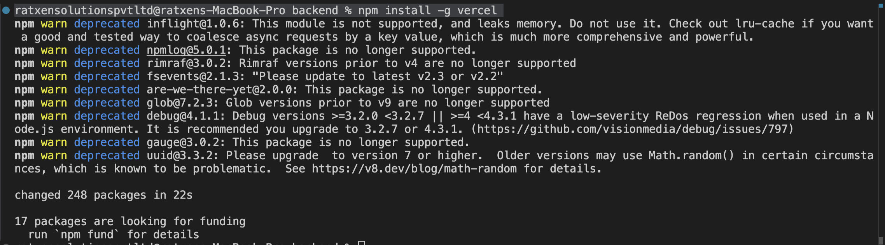
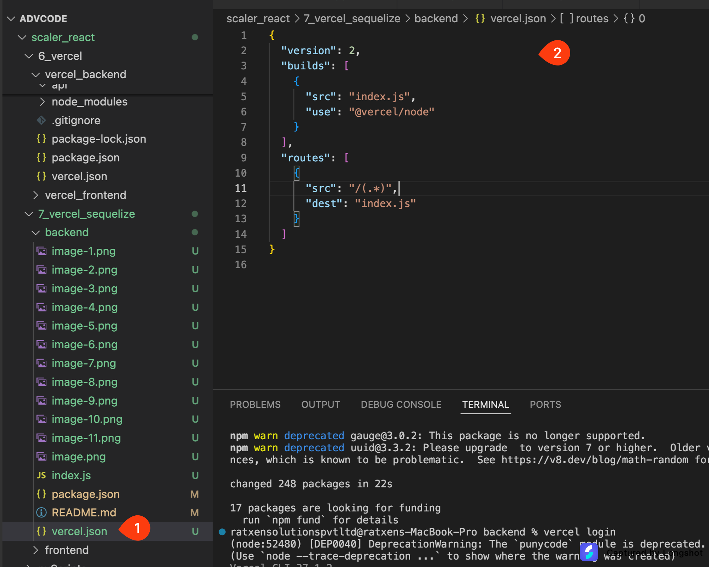

Here we will copy all the steps of the screen shot .

starting the node project
ratxensolutionspvtltd@ratxens-MacBook-Pro backend % npm init


updating the npm :

ratxensolutionspvtltd@ratxens-MacBook-Pro backend % npm install -g npm@10.8.2


initialize git :
ratxensolutionspvtltd@ratxens-MacBook-Pro backend % git init


create git project
ratxensolutionspvtltd@ratxens-MacBook-Pro backend % gh repo create mern_sequelize --public --source=. --remote=origin


pushing to git
ratxensolutionspvtltd@ratxens-MacBook-Pro backend % git branch -m main
ratxensolutionspvtltd@ratxens-MacBook-Pro backend % git add .
ratxensolutionspvtltd@ratxens-MacBook-Pro backend % git commit -m "this is vercel backend for sequelize"
ratxensolutionspvtltd@ratxens-MacBook-Pro backend % git push -u origin main


How to pull from git :
ratxensolutionspvtltd@ratxens-MacBook-Pro backend % git pull


Connecting vercel:
ratxensolutionspvtltd@ratxens-MacBook-Pro backend % npm install -g vercel



ratxensolutionspvtltd@ratxens-MacBook-Pro backend % vercel login


vercel configuration



Express app preparation
ratxensolutionspvtltd@ratxens-MacBook-Pro backend % npm install dotenv express
ratxensolutionspvtltd@ratxens-MacBook-Pro backend % npm install nodemon


.env configuration


index.js configuration

```javascript
import expressInstance from "express";
import { config } from "dotenv";

config();

const appInstance = expressInstance();

const portValue = process.env.PORT || 8000;

appInstance.get("/", (req, res) => {
  res.status(200).send("Hello World");
});

appInstance.use((err, req, res, next) => {
  console.error(err.stack);
  res.status(500).send("Something broke!");
});

// listening at port should be used only when you are not using vercel dev .
// in case of vercel dev - we should not use this .
const startServer = () => {
  try {
    appInstance.listen(portValue, () => {
      console.log(`Node JS server is listening at port ${portValue}`);
    });
  } catch (error) {
    console.log(
      `Failed to listen the server at ${portValue} with the error : ${error}`
    );
  }
};

// commented so that vercel dev can be used.
//startServer();

process.on("unhandledRejection", (reason, promise) => {
  console.error("Unhandled Rejection at:", promise, "reason:", reason);
});

process.on("uncaughtException", (error) => {
  console.error("Uncaught Exception:", error);
  process.exit(1);
});

export default appInstance;
```

Now run the vercel in local dev side


